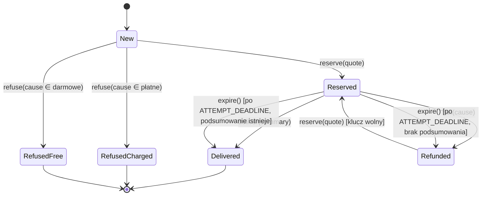

# Niezmiennik „opłata ⇔ wynik” i agregat-strażnik `GenerationAttempt`

> To jest **plan refaktoru**. Kod produkcyjny nie był zmieniany. Każdy cytat `plik:linia` otworzyłem
> w tej sesji na `docs/domain-distillation` @ `973c3ff`. Tam, gdzie piszę „brak”, podaję, jak to
> sprawdziłem (grep / lista plików).
>
> Poprzedni dokument, `context/domain/01-domain-distillation.md`, wybrał agregat (`Generation`).
> Ten dokument wychodzi od **niezmienników**, a nie od agregatu, i wybiera je od nowa. Dochodzi do
> tego samego obszaru, ale węższego i konkretniejszego celu. Wskazuje też dwie naruszalne ścieżki,
> których 01 nie opisał: S1 i S2 w Kroku 3.

---

## Krok 0 — Kontekst

**Źródła wymagań (przeczytane):**
- `context/foundation/prd.md`: wizja, jedyne kryterium sukcesu (`prd.md:31`), guardrail prywatności
  (`prd.md:37`), Business Logic (`prd.md:77-88`).
- `README.md`, sekcja *Summary credits*: de facto specyfikacja rozliczeń (`README.md:272`,
  `README.md:274`). PRD nie mówi o kredytach ani słowa.
- `context/foundation/roadmap.md`: decyzje o mechanizmie rozliczeń (`roadmap.md:175`, D14
  `roadmap.md:296`).
- `context/foundation/test-plan.md`: mapa ryzyk (#1 `test-plan.md:27`), kalibracja
  (`test-plan.md:34`), definicja ochrony ryzyka #1 (`test-plan.md:42`).
- `context/foundation/lessons.md`: same lekcje procesowe, bez reguł domenowych.

**Stack i warstwy, w których żyje logika biznesowa generacji:**

| Warstwa | Miejsce | Rola dziś |
| --- | --- | --- |
| UI (React island) | `src/components/hooks/useGenerateSummary.ts`, `src/components/summaries/*` | tożsamość żądania (`requestId`), retencja klucza, bramki UX |
| API route | `src/pages/api/summaries/generate.ts` (1146 linii) | *transaction script*: każda decyzja „czy i ile obciążyć” zapada w kolejności `return`-ów |
| Serwisy | `src/lib/services/credits.ts`, `summaries.ts`, `llm.ts` | adaptery RPC; część reguł jako kontrakty „never throws” |
| Walidacja | `src/lib/schemas/generate-summary.ts` | zod na granicy |
| Persystencja | `supabase/migrations/*.sql` (`begin_generation`, `persist_summary`, `charge_failed_transcript`, `refund_reservation`, `reconcile_reservation`) | atomowe przejścia pojedynczego wiersza księgi |
| Warstwa domenowa | **brak** (`src/lib/` nie ma `domain/`; lista katalogów sprawdzona) | — |

---

## Krok 1 — Niezmienniki biznesowe

| # | Niezmiennik (musi być zawsze prawdziwy) | Źródło w dokumentach | Gdzie w kodzie |
| --- | --- | --- | --- |
| I1 | Podsumowanie jest **po polsku** i ma **kształt zależny od charakteru** (lista faktów albo przegląd wiedzy) | `prd.md:61`, `prd.md:77-86` | wyłącznie treść promptu; `summarize` sprawdza tylko pustość wyniku (`llm.ts:147-153`) |
| I2 | Podsumowanie powstaje **wyłącznie z niepustej transkrypcji** tego filmu | `prd.md:61`, `prd.md:84` | `generate.ts:823-825`; pusty wynik LLM odrzucony w `llm.ts:150-153` |
| I3 | Charakter ∈ {informational, educational} | `prd.md:100` | zod `generate-summary.ts`; CHECK w `20260613145120_videos_and_summaries.sql:38` |
| I4 | Podsumowania widzi tylko właściciel | `prd.md:37` | RLS + `src/test/authorization-invariants.int.test.ts` |
| **I5** | **Opłata ⇔ wynik.** Użytkownik traci kredyty wyłącznie (a) za **dostarczone** podsumowanie (1 albo 2) lub (b) za odmowę z **klasy płatnej** (1). Nieudana praca kosztuje 0. **Każdy debet zostaje rozstrzygnięty** (`settled` z podsumowaniem, `settled` z `refusal_reason`, `refunded`), a nie zawiśnie | `README.md:272`, `README.md:274`, `roadmap.md:175`, `roadmap.md:296`; kontrakt `credits.ts:8-14`; `test-plan.md:42` („every terminating path either delivers a summary or leaves the balance where it found it”) | rozsiany; patrz Krok 3 |
| I6 | **Jedna intencja = jeden `requestId`** ⇒ co najwyżej jedno obciążenie i jedno podsumowanie; ponowienie dostaje **ten sam** wynik **dla tych samych danych wejściowych** | `roadmap.md:296` („keyed by the request's own `requestId`”); `generate-summary.ts:21-26` | unique `20260723130000_idempotent_generation.sql:48-50`; powiązanie klucza z danymi wejściowymi wyłącznie w kliencie `useGenerateSummary.ts:247-253` |
| I7 | Generacja zablokowana, gdy saldo < koszt | `README.md:272` | warunkowy debet `20260906170000_begin_generation_comment.sql:136-150`; bramka odczytu `generate.ts:542-544` |
| I8 | Długi film (koszt 2) wymaga potwierdzenia **przed** debetem | `README.md:272` | `generate.ts:848-868` |
| I9 | Podsumowanie nie istnieje bez rezerwacji, która je opłaciła; zapis i settle idą w jednej transakcji | `roadmap.md:175` | `20260723120000_atomic_persist_summary.sql:112-124`; `unique (reservation_id)` `20260722120000_link_summary_to_reservation.sql:29-35` |
| I10 | Jedna generacja w toku na użytkownika | komentarz kontraktu `generate.ts:182-189` | lease `generate.ts:190-210`; sweep `20260720170000_generation_lock_lease.sql:42-44` |
| I11 | Transkrypcja > 200 000 znaków jest odrzucana przed debetem | `generate.ts:830-831` (kontrakt) | `summaries.ts:160`; `generate.ts:836-841` |

---

## Krok 2 — Klasyfikacja i wybór #1

Skale: **(a) rdzeniowość** 1–3 (3 = bez tego produkt traci sens: `prd.md:18-22`, `prd.md:31`,
`prd.md:37`). **(b) rozsmarowanie**: liczba warstw (UI / route / serwis / DB), w których reguła
żyje. **(c) egzekucja**: **E** = kod/DB uniemożliwia naruszenie · **D** = tylko deklarowana
(komentarz, prompt) · **N** = naruszalna konkretną ścieżką.

| # | (a) | (b) warstwy | (c) | Komentarz |
| --- | --- | --- | --- | --- |
| I1 | **3** | 1 (prompt) | **D** | rdzeń produktu, ale jedno miejsce; brak mechanizmu weryfikacji |
| I2 | 3 | 2 | E | dwie bramki (whitespace, pusty wynik LLM) |
| I3 | 2 | 3 | E | zod + CHECK |
| I4 | 3 | 2 | E | RLS + roster testowy |
| **I5** | **2,5** | **4** (UI, route, serwis, DB) | **N** | dwie naruszalne ścieżki (S1, S3), domknięcie zależy od człowieka |
| I6 | 2 | 3 | **N** | serwer nie wiąże klucza z wejściem (S2) |
| I7 | 2 | 3 | E | niespójna bramka odczytu (`<= 0` vs koszt), ale debet atomowy |
| I8 | 1,5 | 2 | E | — |
| I9 | 2 | 1 (DB) | E | jedna transakcja, F23 |
| I10 | 1 | 2 | E | okno 600 s, backstop w księdze |
| I11 | 1 | 2 | E | — |

**Dlaczego I5 ma w (a) 2,5, a nie 2.** Kredyty to subdomena *supporting*. Tylko że I5 obejmuje
**jedyny przepływ produktu** (US-01, `prd.md:41-45`), a każdą egzekucję I1 i I2 („odrzuć zły
wynik”) wykonuje przez I5: zły wynik ma kończyć się zwrotem. Jeśli I5 jest naruszalny, twarde
egzekwowanie I1 zamienia się w „płacisz za odrzucone podsumowanie”. Ryzyko #1 ma w mapie ryzyk
najwyższe prawdopodobieństwo (`test-plan.md:27`). Jego wpływ wraca do `High` w chwili otwarcia
rejestracji (`test-plan.md:34`).

**Wybór: I5 (z I6 jako warunkiem koniecznym).**

- **Najsłabiej egzekwowany spośród rdzeniowych.** To jedyny niezmiennik oceniony ≥ 2 w (a), który
  ma **N** i ≥ 3 warstwy. I6 też ma N, ale jego skutki pieniężne przechodzą przez I5, a naprawa
  wymaga tego samego agregatu (tożsamość próby).
- **Dlaczego nie I1**, choć jest najbardziej rdzeniowy i tylko deklarowany:
  1. żyje w **jednym** miejscu, więc agregat-strażnik nic nie scala;
  2. „tekst po polsku o właściwym kształcie” to własność wyjścia modelu. Egzekwuje się ją
     **nową zdolnością** (walidator języka/kształtu, zestaw golden z `test-plan.md` §6.5), a nie
     restrukturyzacją rozsianej reguły;
  3. fail-fast dla I1 (walidator rzuca → zwrot) **wymaga najpierw** szczelnego I5.
     Kolejność jest więc I5 → I1. Rekomendacja dla I1 jest poza tym planem: walidator w
     `summarize()`, który rzuca, jak dziś pusty tekst (`llm.ts:150-153`).

---

## Krok 3 — Diagnoza I5 (+ I6)

### 3.1 Gdzie dziś żyje reguła, warstwa po warstwie

**UI**

| Miejsce | Co robi | Ocena |
| --- | --- | --- |
| `useGenerateSummary.ts:247-253` | mintuje `requestId`; używa go ponownie tylko przy tym samym `url` + `character` | **klient jest jedynym strażnikiem powiązania klucz ↔ wejście** (I6); serwer tego nie sprawdza (3.2, S2) |
| `useGenerateSummary.ts:294-300` | zwalnia klucz po **każdej** odpowiedzi HTTP poza `422` + `ambiguousCharge` | poprawne tylko wtedy, gdy każda odpowiedź inna niż 422 znaczy „rozstrzygnięte”. Przy S1 tak nie jest |
| `useGenerateSummary.ts:185-195` | spisuje trzy niezmienniki płatnej ścieżki, które „fail silently” | reguła zadeklarowana w komentarzu hooka, nie w domenie |
| `GenerateSummaryForm.tsx:72-75` | bramka „brak kredytów” / „za drogie” | tylko UX; serwer egzekwuje (komentarz `:72`). OK |
| `PendingSummaryCard.tsx:204-206` | renderuje `charged` | prezentacja wyniku I5, poprawna |

**API route (`generate.ts`)**

| Miejsce | Co robi | Ocena |
| --- | --- | --- |
| `:127` | `REFUSAL_CHARGE = 1` | polityka odmów część 1 |
| `:86-120` | `REFUSAL_COPY`, `REFUSAL_CODE` | polityka odmów część 2 (trzy równoległe mapy) |
| `:625-630`, `:753`, `:823-825` | cztery wywołania `refuseAndCharge` | **niespójnie rozsmarowane**: „płatna czy nie” wynika z tego, **którą funkcję** wywołuje dany `return` |
| `:764-767` | wolne 422 dla `failed`/`timeout`, zapisane inline | wyjątek od polityki leży 130 linii od reszty polityki |
| `:616-621`, `:655-657`, `:693-699`, `:836-841` | 413 / 503 / 429 / 413 bez obciążenia | darmowość wynika z **braku** wywołania, a nie z nazwanej reguły |
| `:542-544` | bramka `balance <= 0` | inna reguła niż atomowa (`balance >= cost`, `:887-907`); świadomie „minimum-1”, bez nazwy w modelu |
| `:926-939` | awaria LLM → `refundReservation` → **wynik ignorowany** → 502 | **błąd połykany** (S1) |
| `:1070-1079` | awaria zapisu → `refundReservation` → **wynik ignorowany** → 500 | **błąd połykany** (S1) |
| `:951-954`, `:988-992` | „`try` redundant BY DESIGN”, bo rzut między debetem a zapisem ominąłby zwrot | I5 zależy od tego, że **każdy** moduł wołany w strefie `:926-1024` dotrzymuje kontraktu „never throws” (`metadata-cache.ts:114-118`, `supadata-budget.ts:573-604`). To dyscyplina, a nie egzekucja |
| `:1085-1095` | `persist_summary` → `not_reserved` → 500 bez zwrotu | poprawne (wiersz już rozstrzygnięty); pokryte testem `generate.db.int.test.ts:433-458` |
| `:387-395` | replay 200 z treścią poprzedniego podsumowania | nie sprawdza, czy replay dotyczy **tego samego filmu** (S2) |

**Serwisy**

| Miejsce | Co robi | Ocena |
| --- | --- | --- |
| `credits.ts:437-472` | `refundReservation`: każdy błąd → `console.error` + `captureEvent` + `return false` | **błąd połykany**: wywołujący dostaje `boolean` i go ignoruje |
| `credits.ts:248-251`, `llm.ts:80-83`, `summaries.ts:273`, `generate.ts:1028` | powołują się na „hourly / one-hour reconciliation sweep” | **deklaracja bez mechanizmu** (3.2) |
| `credits.ts:266-330` | `chargeFailedTranscript` nie rzuca; rozróżnia `notCharged` / `ambiguous` | świadome i **uczciwe**: niepewność trafia do odpowiedzi (`generate.ts:291-298`). Wzorzec do uogólnienia |
| `credits.ts:383-391` | `lookupRefusalReplay` przy błędzie → `null` | komentarz sam przyznaje, że to fail-**open** i może skończyć się drugim obciążeniem (`:386-388`) |

**Baza danych**

| Miejsce | Co robi | Ocena |
| --- | --- | --- |
| `20260906170000_begin_generation_comment.sql:79-84` | wiersz `reserved` na tym kluczu → `in_progress`, **bez względu na wiek** | zawieszony debet blokuje swój klucz na zawsze (S1) |
| `20260722120000_link_summary_to_reservation.sql:37-47` | `reconcile_reservation` jest poprawny, ale wołany **ręcznie** wg runbooka | domknięcie I5 zależy od człowieka |
| `20260720160000_credit_reservations.sql:22-29`, `20260723130000_idempotent_generation.sql:35-36`, `20260731110000_charge_failed_transcript.sql:46-48` | kolumny księgi: brak `youtube_id` i `character` | serwer nie ma czym sprawdzić I6 (S2) |
| `20260731110000_charge_failed_transcript.sql:48` | CHECK na liście powodów płatnych | kopia polityki D14 w DB; dziś zgodna z TS (`credits.ts:191`) |
| `20260723120000_atomic_persist_summary.sql:69-124` | lock → replay → gate → zapis + settle w jednej transakcji | **egzekwuje** (I9); zostaje bez zmian |

### 3.2 Weryfikacja „sweepu”

- `grep -rln "pg_cron\|cron.schedule" supabase/` trafia tylko w komentarz
  `20260723140000_transcript_quote_lifecycle.sql:26` („so pg_cron (or the operator) can call it”).
  **Żadna** migracja nie planuje zadania cyklicznego.
- `wrangler.jsonc` nie ma `triggers` ani `crons` (grep bez trafień).
- `scripts/` zawiera `check-tokens.mjs`, `grant-credits.mjs`, `sync-prod-to-local.mjs`. Brak skryptu
  do rekoncyliacji.

Wniosek: „hourly reconciliation sweep”, na który powołują się cztery komentarze w kodzie
(`credits.ts:250`, `llm.ts:82`, `summaries.ts:273`, `generate.ts:1028`) i dwie migracje
(`20260731110000_charge_failed_transcript.sql:17-19`, `20260723120000_atomic_persist_summary.sql:10`),
**nie istnieje**.

### 3.3 Naruszalne ścieżki

**S1 — połknięty błąd zwrotu ⇒ podwójne obciążenie za jedno podsumowanie (I5).**
1. Debet 1 kredytu, rezerwacja `R1` w stanie `reserved` (`generate.ts:887`).
2. `summarize` rzuca (`generate.ts:932-933`).
3. `refund_reservation` kończy się błędem transportu. `refundReservation` łapie go i zwraca `false`
   (`credits.ts:463-470`).
4. Route ignoruje wynik i odpowiada **502** (`generate.ts:937-938`).
5. Klient dostał odpowiedź HTTP, więc **zwalnia klucz** (`useGenerateSummary.ts:298-300`).
6. Użytkownik klika jeszcze raz i dostaje nowy UUID (`useGenerateSummary.ts:251-252`). Powstaje nowy
   debet `R2`. Generacja się udaje.
7. Stan końcowy: saldo **−2** za **jedno** podsumowanie. `R1` wisi w `reserved`. Retry na starym
   kluczu dostałby `in_progress` / 429 na zawsze (`20260906170000_begin_generation_comment.sql:79-84`).
   Automatycznego domknięcia nie ma (3.2).

Pokrycie testami: stuby w `generate.int.test.ts` dla `refund_reservation` zwracają tylko
`ok(true)` (`:523`, `:532`). `withFailingRpc` w `generate.db.int.test.ts:176` jest użyty tylko dla
`persist_summary` (`:297`). **Nie znalazłem testu na poziomie endpointu**, który sprawdza, co
użytkownik dostaje, gdy **sam zwrot** zawodzi.

**S2 — klient jedynym strażnikiem tożsamości (I6).**
Wystarczy wysłać POST z `requestId` użytym wcześniej dla filmu A, ale z `url` filmu B. Sonda
`begin_generation(amount => null)` znajdzie `settled` z podsumowaniem i zwróci `replay`. Endpoint
odpowie **200 z podsumowaniem filmu A** jako wynikiem dla B (`generate.ts:509-523`, `:387-395`).
Pieniądze się nie zgadzają w drugą stronę: nic nie pobrano, ale użytkownik „dostał” nie to, o co
prosił. Przed tym chroni wyłącznie warunek w hooku (`useGenerateSummary.ts:251-252`). Ten sam
mechanizm dotyczy replayu odmowy płatnej (`generate.ts:417-422`).

**S3 — reguła jako kolejność `return`-ów (I5, ryzyko regresji).**
Dodanie nowego wyjścia 422 (np. bramki S-10 z `roadmap.md:303`) wymaga, żeby autor sam wybrał
między `refuseAndCharge` a zwykłym `Response.json`. Nic nie wymusza tej decyzji ani jej nie testuje
jako *polityki*. Testy pilnują istniejących wyjść, nie reguły. Tak samo każdy nowy `await` w strefie
`generate.ts:926-1024` może rzucić i ominąć zwrot. Chroni przed tym tylko komentarz `:951-954`.

---

## Krok 4 — Projekt agregatu-strażnika

### 4.1 Granica i nazwa

**Agregat `GenerationAttempt`**, tożsamość `(userId, requestId)`. Root obejmuje **jedną** encję
persystencji, wiersz `credit_reservations` (0 albo 1 nie-`refunded` na klucz). Podsumowanie i film
**nie** wchodzą do agregatu: to wynik przejścia `deliver`, zapisany w tej samej transakcji
(`persist_summary`), ale z własnym cyklem życia (usuwanie, S-03).

**Nazwany niezmiennik agregatu (do umieszczenia w nagłówku modułu):**

> `CHARGE_FOLLOWS_OUTCOME` — dla każdej próby `(userId, requestId)`: łączna zmiana salda ∈
> {`−cost` jeśli `delivered`, `−1` jeśli `refusedCharged`, `0` w każdym innym stanie końcowym};
> stan `reserved` jest przejściowy i ma termin `ATTEMPT_DEADLINE`; po nim rozstrzyga go system,
> nie człowiek; próba odpowiada tylko na **swój** odcisk wejścia `(youtubeId, character)`.

**Umiejscowienie:** `src/lib/domain/generation-attempt.ts` (czysty moduł: zero I/O, zero
`astro:env`, osiągalny z projektu `unit`). Repozytorium: `src/lib/services/generation-attempt-repository.ts`.
Serwis aplikacyjny: `src/lib/services/generate-summary.ts`. Dziś `src/lib/` nie ma katalogu
`domain/`. To świadome nowe miejsce, zgodne z konwencją „business logic in `src/lib/`” z CLAUDE.md.

### 4.2 Maszyna stanów



`RefusedFree` nie ma wiersza w księdze (tak jak dziś). `ClosedByOperator` (settled, bez
podsumowania i bez `refusal_reason`) to stan tylko do odczytu, wynik ręcznego `settle_reservation`.

### 4.3 Obiekty wartości i polityka

```ts
// src/lib/domain/generation-attempt.ts
export type RequestFingerprint = Readonly<{ youtubeId: string; character: ChannelCharacter }>;
export type Cost = 1 | 2;

export type PriceQuote = Readonly<{ cost: Cost; transcriptChars: number; confirmed: boolean }>;

/** Wszystkie przyczyny odmowy PRZED debetem — zamknięta lista, jedna tabela. */
export type RefusalCause =
  | "noCaptions"        // fresh 206 albo cache 'unavailable'
  | "emptyCached"       // cache 'empty'
  | "whitespace"        // transkrypcja bez słów
  | "fetchFailed"       // failed/timeout — koszt nieznany
  | "tooLong"           // > HARD_MAX_TRANSCRIPT_CHARS
  | "budgetExhausted"
  | "rateLimited"
  | "noCredits";        // bramka minimum-1

/** JEDYNE miejsce reguły D14 (README.md:274, roadmap.md:296). */
export const REFUSAL_POLICY = {
  noCaptions:      { charge: 1, ledgerReason: "unavailable" },
  emptyCached:     { charge: 1, ledgerReason: "empty" },
  whitespace:      { charge: 1, ledgerReason: "whitespace" },
  fetchFailed:     { charge: 0, ledgerReason: null },
  tooLong:         { charge: 0, ledgerReason: null },
  budgetExhausted: { charge: 0, ledgerReason: null },
  rateLimited:     { charge: 0, ledgerReason: null },
  noCredits:       { charge: 0, ledgerReason: null },
} as const satisfies Record<RefusalCause, { charge: 0 | 1; ledgerReason: RefusalReason | null }>;

export const ATTEMPT_DEADLINE_SECONDS = 900; // > lease 600 s (generate.ts:190-210) > LLM 300 s (llm.ts:89)
```

Kopia HTTP (`REFUSAL_COPY` i `REFUSAL_CODE`, `generate.ts:86-120`) **nie** trafia do domeny, tylko
do mapowania w route. Polityka mówi *czy i ile*, a nie *jakimi słowami*.

### 4.4 Błędy domenowe

Każdy błąd jest klasą z polem `code`. Nielegalna operacja **rzuca** i nie zmienia stanu.

| Błąd | Kiedy | Dane |
| --- | --- | --- |
| `AttemptInProgress` | `begin` na `Reserved` przed terminem | — |
| `RequestKeyReused` | `begin` z odciskiem ≠ zapisanego | `expected`, `actual` (bez PII) |
| `AttemptClosed` | `begin` na `ClosedByOperator` | — |
| `LongVideoNotConfirmed` | `quote` z `cost > 1` i `!allowLong` | `cost`, `transcriptChars` |
| `TranscriptTooLong` | `quote` powyżej hard cap | `transcriptChars` |
| `InsufficientCredits` | repozytorium odrzuciło `reserve` | `cost`, `balance` |
| `IllegalTransition` | np. `refuse` po `reserve`, `deliver` bez `reserve`, dwa `deliver` | `from`, `operation` |
| `EmptySummary` | `deliver` z pustym tekstem | — |
| `TransitionRejected` | RPC zwróciło strukturalny błąd → **dowód**, że nic nie zostało zapisane | `transition` |
| `TransitionOutcomeUnknown` | odrzucony transport / zniekształcona odpowiedź → **brak dowodu** | `transition`, `reservationId?` |

`TransitionOutcomeUnknown` uogólnia dzisiejsze `ambiguous` (`credits.ts:205-216`) na **wszystkie**
przejścia, także zwrot.

### 4.5 Root: sygnatury i pseudokod

```ts
export class GenerationAttempt {
  private constructor(
    readonly userId: string,
    readonly requestId: string,
    private state: AttemptState,
    private pending: Transition | null,     // co najwyżej JEDNO niezatwierdzone przejście
  ) {}

  static rehydrate(snapshot: AttemptSnapshot): GenerationAttempt;

  /** Precondition: stan pozwala zacząć albo odtworzyć. Zwraca decyzję, nie efekt uboczny. */
  begin(fp: RequestFingerprint): StartDecision {
    switch (this.state.kind) {
      case "new":
      case "refunded":        return { kind: "proceed" };
      case "reserved":        throw new AttemptInProgress();          // przeterminowane rozstrzygnął load()
      case "delivered":       assertSameFingerprint(this.state.fp, fp); return { kind: "replayDelivered", ...this.state };
      case "refusedCharged":  assertSameFingerprint(this.state.fp, fp); return { kind: "replayRefusal", reason: this.state.reason };
      case "closedByOperator":throw new AttemptClosed();
    }
  }

  /** Czysta wycena; nie zmienia stanu. */
  quote(transcriptChars: number, allowLong: boolean): PriceQuote {
    if (transcriptChars > HARD_MAX_TRANSCRIPT_CHARS) throw new TranscriptTooLong(transcriptChars);
    const cost = summaryCost(transcriptChars);
    if (cost > 1 && !allowLong) throw new LongVideoNotConfirmed(cost, transcriptChars);
    return { cost, transcriptChars, confirmed: allowLong };
  }

  refuse(cause: RefusalCause, fp: RequestFingerprint): RefusalDecision {
    this.requireNoPending();
    if (this.state.kind !== "new" && this.state.kind !== "refunded")
      throw new IllegalTransition(this.state.kind, "refuse");      // po debecie wolno tylko fail()
    const rule = REFUSAL_POLICY[cause];
    if (rule.charge === 0) return { kind: "free", cause };          // brak przejścia w księdze
    this.pending = { kind: "chargeRefusal", reason: rule.ledgerReason, amount: 1, fp };
    return { kind: "charged", cause };
  }

  reserve(q: PriceQuote, fp: RequestFingerprint): void {
    this.requireNoPending();
    if (this.state.kind !== "new" && this.state.kind !== "refunded")
      throw new IllegalTransition(this.state.kind, "reserve");
    if (q.cost > 1 && !q.confirmed) throw new LongVideoNotConfirmed(q.cost, q.transcriptChars); // obrona w głąb
    this.pending = { kind: "reserve", amount: q.cost, fp };
  }

  deliver(summary: SummaryDraft): void {
    this.requireNoPending();
    if (this.state.kind !== "reserved") throw new IllegalTransition(this.state.kind, "deliver");
    if (summary.text.trim() === "") throw new EmptySummary();
    this.pending = { kind: "deliver", reservationId: this.state.reservationId, summary };
  }

  fail(cause: FailureCause): void {
    this.requireNoPending();
    if (this.state.kind !== "reserved") throw new IllegalTransition(this.state.kind, "fail");
    this.pending = { kind: "refund", reservationId: this.state.reservationId, cause };
  }

  /** Wywoływane wyłącznie przez repozytorium po udanym commit. */
  applyCommitted(next: AttemptState): void;
  pendingTransition(): Transition | null;
}
```

Wybór projektowy: **root nie wykonuje I/O**. Decyduje, czy przejście jest legalne, i zapamiętuje
je jako `pending`. Repozytorium zatwierdza je **jednym** RPC. Dzięki temu cały moduł testuje się
testami czystymi (§6.1) bez stubów.

### 4.6 Repozytorium i transakcje

```ts
export interface GenerationAttemptRepository {
  /** JEDNA transakcja: lock wiersza klucza + rozstrzygnięcie przeterminowanego `reserved`. */
  load(userId: string, requestId: string): Promise<GenerationAttempt>;
  /** Zatwierdza dokładnie jedno `pending` jednym RPC; nigdy nie zwraca `boolean`. */
  commit(attempt: GenerationAttempt): Promise<CommitResult>;   // rzuca Transition* / InsufficientCredits
}
```

| Przejście | RPC (jedna transakcja) | Stan dziś | Zmiana |
| --- | --- | --- | --- |
| `load` | **nowe** `open_generation_attempt(user, request, deadline_seconds)` | `begin_generation(amount => null)` `generate.ts:512` | lock klucza (`for update`, jak `20260906170000_begin_generation_comment.sql:72-77`); jeśli `reserved` i `created_at < now() - deadline`, to **w tej samej transakcji** logika `reconcile_reservation` (`20260722120000_link_summary_to_reservation.sql:57-90`); zwraca snapshot z odciskiem, `refusal_reason` i saldem |
| `reserve` | `begin_generation` z odciskiem (nowa sygnatura) | `generate.ts:887` | zapisuje `request_youtube_id`, `request_character`; nadal `where balance >= amount` (`:136-139`) |
| `chargeRefusal` | `charge_failed_transcript` z odciskiem | `generate.ts:350-355` | j.w.; bez zmiany logiki replay/race (`20260731110000_charge_failed_transcript.sql:126-140`, `:183-199`) |
| `deliver` | `persist_summary` | `generate.ts:1044` | **bez zmian** (I9 już atomowe) |
| `refund` | `refund_reservation` | `generate.ts:937`, `:1074` | bez zmian w SQL; adapter **rzuca** `TransitionOutcomeUnknown` zamiast zwracać `false` |
| sweep | **nowe** `reconcile_expired_reservations(deadline_seconds, batch)` | brak (3.2) | ta sama logika co `load`, dla kluczy, których nikt nie ponowił; wywoływane cyklicznie (decyzja otwarta, 5.4) |

**Dlaczego to domyka I5 atomowo.** Samego zwrotu nie da się zrobić atomowo z awarią LLM, bo LLM
to system zewnętrzny. Planu nie opieram więc na „zwrot musi się udać”, tylko na trzech
gwarancjach, z których każda jest jedną transakcją:
1. `deliver` = zapis + settle razem (jest dziś);
2. każdy `reserved` ma termin, a **pierwsze** dotknięcie klucza po terminie (`load`) albo sweep
   rozstrzyga go razem z blokadą wiersza. `persist_summary` spóźnionego żądania przegra ten lock i
   dostanie `not_reserved` (`20260723120000_atomic_persist_summary.sql:72-83`, `:100-108`), co route
   już obsługuje (`generate.ts:1085-1095`);
3. porażka zwrotu nie jest połykana. Wynikiem żądania jest `TransitionOutcomeUnknown`, a klient
   **zatrzymuje klucz**. Ponowienie po terminie trafia w gwarancję 2 zamiast wystawić nowy debet.

**Schemat (expand-only, zgodnie z konwencją migracji):**
- `credit_reservations.request_youtube_id text null`, `request_character text null check (...)`
  (null dla wierszy historycznych: brak odcisku = brak sprawdzenia, jak dziś).
- `begin_generation` ma zwracany typ `returns table`, więc zmiana sygnatury wymaga nowej funkcji
  (ograniczenie opisane w `20260731110000_charge_failed_transcript.sql:21-24`). Nowe funkcje
  dostają `revoke all ... from public, anon, authenticated` + `grant ... to service_role` i wpis w
  rosterze `src/test/authorization-invariants.int.test.ts`. Stare funkcje usuwa osobna migracja
  kontraktowa po wdrożeniu Workera.

### 4.7 Serwis aplikacyjny i cienki route

Orkestracja vendorów (cache, budżet Supadata, metadane, telemetria) **zostaje** poza agregatem: to
nie jest reguła I5. Przenosi się z route do `generate-summary.ts`. W każdym punkcie decyzji woła
metodę agregatu, a nie wybiera funkcję.

```ts
// src/lib/services/generate-summary.ts (pseudokod — tylko punkty styku z agregatem)
export async function generateSummary(cmd: GenerateCommand, deps: Deps): Promise<GenerationOutcome> {
  const fp = { youtubeId: cmd.youtubeId, character: cmd.character };
  const attempt = await deps.attempts.load(cmd.userId, cmd.requestId);

  const start = attempt.begin(fp);                     // AttemptInProgress | RequestKeyReused | AttemptClosed
  if (start.kind !== "proceed") return replayOutcome(start, await deps.balance());

  if (!(await deps.hasMinimumBalance())) return refuse(attempt, "noCredits", fp);

  const t = await acquireTranscript(cmd, deps);        // cache / budżet / rate limit / fetch — bez zmian
  if (t.kind === "refused") return refuse(attempt, t.cause, fp);   // noCaptions | emptyCached | fetchFailed | tooLong | budgetExhausted | rateLimited
  if (t.content.trim() === "") return refuse(attempt, "whitespace", fp);

  const quote = attempt.quote(t.content.length, cmd.allowLong);    // TranscriptTooLong | LongVideoNotConfirmed (+ saveTranscriptQuote w handlerze)
  attempt.reserve(quote, fp);
  const reserved = await deps.attempts.commit(attempt);            // InsufficientCredits | Transition*

  return await withCompensation(attempt, deps, async () => {       // JEDYNE miejsce, gdzie łapie się błąd po debecie
    const summary = await deps.summarize(t.content, cmd.character);
    const metadata = await resolveMetadata(cmd, deps);             // total; budżet może dać skipped_budget
    attempt.deliver({ text: summary.text, ...summary, metadata, telemetry });
    return deliveredOutcome(await deps.attempts.commit(attempt), quote, reserved);
  });
}

async function withCompensation<T>(attempt, deps, work: () => Promise<T>): Promise<T> {
  try { return await work(); }
  catch (cause) {
    if (cause instanceof TransitionOutcomeUnknown) throw cause;   // deliver niepewny: NIE zwracaj
    attempt.fail(classify(cause));
    await deps.attempts.commit(attempt);                          // rzuca TransitionOutcomeUnknown — nie połyka
    throw new GenerationFailed(classify(cause));                  // udokumentowany zwrot wykonany
  }
}
```

`withCompensation` zastępuje dzisiejszy „redundantny `try`” (`generate.ts:951-954`) i dwa
wywołania zwrotu (`:937`, `:1074`) **jedną** konstrukcją. Każdy przyszły `await` w strefie po
debecie jest objęty zwrotem z założenia, a nie z dyscypliny.

```ts
// src/pages/api/summaries/generate.ts — docelowo
export const prerender = false;

export const POST: APIRoute = async (context) => {
  const pre = preflight(context);                         // 503 notConfigured | 401 — bez zmian
  if (pre.response) return pre.response;

  const parsed = parseGenerateCommand(await context.request.json().catch(() => null), pre.userId); // 400
  if (!parsed.ok) return parsed.response;

  return withGenerationLease(pre.admin, pre.userId, async (meter) => {     // 429 generationBusy, flush + release w finally
    try {
      return toHttp(await generateSummary(parsed.command, deps(pre, meter)));
    } catch (error) {
      return domainErrorToHttp(error);                     // nieznany błąd → 500 generic + captureEvent
    }
  });
};
```

**Mapowanie błędów domenowych → HTTP** (jedna tabela, kody zgodne z `copy.errors.codes`):

| Błąd / wynik | Status | `code` | Dodatkowo |
| --- | --- | --- | --- |
| `AttemptInProgress` | 429 | `generationInProgress` (`pl.ts:303`) | — |
| `AttemptClosed` | 409 | `requestAlreadyProcessed` (`pl.ts:305`) | — |
| `RequestKeyReused` | 409 | **`requestKeyReused`** (nowy) | klient mintuje nowy klucz |
| `LongVideoNotConfirmed` | 409 | (dziś bez `code`) | `requiresConfirmation`, `cost`, `transcriptLength` |
| `TranscriptTooLong` | 413 | `transcriptTooLong` | — |
| `InsufficientCredits` | 402 | `insufficientCredits` | `cost`, `creditsRemaining` |
| odmowa `charged` / `free` | 422 / 413 / 429 / 503 | z tabeli kopii w route | `charged` wg **wyniku commit**, nie wg polityki |
| `GenerationFailed` | 502 / 500 | jak dziś | `charged: false` (zwrot **udowodniony**) |
| `TransitionOutcomeUnknown` | 500 (albo 422 dla odmowy) | `generic` / kod odmowy | **`ambiguousCharge: true`** na każdym statusie |
| `TransitionRejected` na `chargeRefusal` | 422 | kod odmowy | `charged: false` (jak dziś `notCharged`) |

**Egzekucja przechodzi z klienta na serwer:**
- *Powiązanie klucz ↔ wejście (I6).* Dziś pilnuje go tylko `useGenerateSummary.ts:251-252`.
  Docelowo egzekwuje je `begin` → `RequestKeyReused`. Warunek w hooku zostaje jako UX (unika
  zbędnego 409), ale przestaje być strażnikiem.
- *Retencja klucza.* Dziś `useGenerateSummary.ts:298` trzyma klucz tylko przy `422 && ambiguousCharge`.
  Docelowo reguła brzmi: trzymaj przy błędzie sieci **albo** `ambiguousCharge === true` na
  **dowolnym** statusie. O tym, kiedy wynik jest niepewny, decyduje serwer (`TransitionOutcomeUnknown`).
  Klient tylko wykonuje tę decyzję.

---

## Krok 5 — Before/after, fazy, testy, nazwy

### 5.1 Before / after

| Dzisiejsze miejsce reguły | Before | After |
| --- | --- | --- |
| `generate.ts:127`, `:86-120` | trzy mapy + stała | `REFUSAL_POLICY` w domenie (czy/ile); kopia i kod w route (jak mówić) |
| `generate.ts:625-630`, `:753`, `:823-825` | 4× `refuseAndCharge` | `refuse(attempt, cause)` → `attempt.refuse` |
| `generate.ts:764-767` | wolne 422 zapisane inline | `refuse(attempt, "fetchFailed")`; darmowość czytana z polityki |
| `generate.ts:616-621`, `:655-657`, `:693-699`, `:836-841` | darmowe, bo nic nie wywołano | nazwane przyczyny `tooLong` / `budgetExhausted` / `rateLimited`, `charge: 0` w polityce |
| `generate.ts:542-544` | anonimowa bramka `<= 0` | przyczyna `noCredits` + `hasMinimumBalance`, nazwana jako bramka minimum-1 |
| `generate.ts:848-868` | `if (cost > 1 && !allowLong)` | `attempt.quote` → `LongVideoNotConfirmed`; zapis quote w handlerze serwisu |
| `generate.ts:887-924` | debet + ręczne rozgałęzienie `outcome` | `attempt.reserve` + `repository.commit` |
| `generate.ts:926-939`, `:1070-1079` | `refundReservation`, wynik ignorowany | `withCompensation` → `attempt.fail` → commit **rzuca** przy niepewności |
| `generate.ts:951-954`, `:988-992` | „redundantny `try`” jako strażnik | objęte `withCompensation` z konstrukcji |
| `generate.ts:387-395`, `:417-422` | replay bez sprawdzenia wejścia | `attempt.begin(fp)` → `RequestKeyReused` |
| `credits.ts:437-472` | `Promise<boolean>`, połyka błąd | adapter repozytorium: `TransitionRejected` / `TransitionOutcomeUnknown`; `captureEvent` zostaje |
| `credits.ts:248-251`, `llm.ts:80-83`, `summaries.ts:273`, `generate.ts:1028`, `20260731110000_charge_failed_transcript.sql:17-19` | obietnica „hourly sweep” | komentarze wskazują `ATTEMPT_DEADLINE_SECONDS`, `open_generation_attempt` i sweep (zmiana komentarzy w kodzie; komentarzy w zastosowanych migracjach się nie edytuje, sprostowanie trafia do nowej migracji, jak `20260906170000_begin_generation_comment.sql:4-17`) |
| `20260906170000_begin_generation_comment.sql:79-84` | `reserved` ⇒ `in_progress` na zawsze | `open_generation_attempt`: `reserved` po terminie ⇒ rozstrzygnięte w tej samej transakcji |
| `20260722120000_link_summary_to_reservation.sql:37-47` | ręczny runbook | ta sama logika w `load` i w sweepie; ręczne wywołanie zostaje jako narzędzie operatora |
| `useGenerateSummary.ts:251-252` | jedyny strażnik I6 | UX; strażnikiem jest serwer |
| `useGenerateSummary.ts:298-300` | trzyma klucz tylko przy 422-ambiguous | trzyma przy `ambiguousCharge` na każdym statusie |
| `20260723120000_atomic_persist_summary.sql` | atomowy zapis + settle | **bez zmian** |

### 5.2 Fazy refaktoru

Projekt ma runner (Vitest `unit` + `integration`, Playwright) i opisaną dyscyplinę testów
(`test-plan.md` §6). Oznaczenia: **[TF]** = test-first (red → green), **[G]** = refaktor pod
zielonymi testami (zachowanie bez zmian).

| Faza | Zakres | Tryb | Warstwa testów |
| --- | --- | --- | --- |
| **P0** | Testy charakteryzujące S1 i S2 na obecnym kodzie: stub `refund_reservation` z błędem transportu po awarii LLM; ten sam `requestId` z innym `url`. Asercje opisują **pożądane** zachowanie z README i `test-plan.md:42`, więc mają być czerwone. Oznaczone `it.fails`, z odnośnikiem do tego planu | **[TF]** | integration (stub, §6.2) |
| **P1** | `src/lib/domain/generation-attempt.ts`: stany, `REFUSAL_POLICY`, błędy, `begin/quote/refuse/reserve/deliver/fail` | **[TF]** | unit, czyste (§6.1); `it.each` na przejście |
| **P2** | Adapter repozytorium nad **istniejącymi** RPC: mapowanie wynik RPC → stan / błąd; brak `boolean` | **[TF]** | unit, hermetyczne (`supabase-stub.ts`) |
| **P3** | Migracja: kolumny odcisku, `open_generation_attempt`, nowa sygnatura debetu i opłaty z odciskiem, `reconcile_expired_reservations`; roster autoryzacji | **[TF]** | integration, prawdziwa baza (§6.2 salda, §6.3 roster) |
| **P4** | Serwis `generate-summary.ts` + cienki route + `withCompensation` + `domainErrorToHttp`. Najpierw przełożenie 1:1 pod zielonymi `generate.int.test.ts`, `generate.db.int.test.ts` i e2e, potem przełączenie P0 z `it.fails` na `it` | **[G]**, potem **[TF]** dla P0 | integration + e2e (bez nowych specyfikacji) |
| **P5** | Klient: retencja klucza przy `ambiguousCharge` na dowolnym statusie; `requestKeyReused` w `pl.ts` | **[TF]** | unit (`messageForError`); `error-codes.test.ts` pilnuje kodu |
| **P6** | Harmonogram sweepu (decyzja 5.4), zdarzenie raportujące, sprostowanie komentarzy o „hourly sweep” (w migracjach przez nową migrację) | **[TF]** dla zdarzenia | unit: test promocji przez `setReportingSink` |

E2e bez nowej specyfikacji: nie da się wstrzyknąć awarii `refund_reservation` przez granicę
procesu bez nowego szwu w aplikacji (§6.4). Dlatego dowód S1 zostaje w warstwie integracyjnej. Trzy
istniejące specyfikacje pilnują, że P4 nie zmienia karty ani księgi.

### 5.3 Przypadki testowe niezmiennika

Wyrocznia: `README.md:272`, `README.md:274`, `test-plan.md:42`, `roadmap.md:296`. **Nie**
implementacja.

**Legalne przejścia (P1 unit, P3/P4 integration z saldem przed/po):**

| # | Scenariusz | Oczekiwane |
| --- | --- | --- |
| L1 | New → reserve(1) → deliver | saldo −1; `settled` + podsumowanie; 200 |
| L2 | New → quote(>40 000, allowLong) → reserve(2) → deliver | saldo −2 |
| L3 | New → refuse(`noCaptions`) | saldo −1; `settled` + `refusal_reason='unavailable'`; 422 `charged: true` |
| L4 | `it.each` po `emptyCached`, `whitespace` | saldo −1 każdy |
| L5 | `it.each` po `fetchFailed`, `tooLong`, `budgetExhausted`, `rateLimited`, `noCredits` | saldo 0; brak wiersza w księdze |
| L6 | New → reserve → fail (zwrot OK) | saldo 0; `refunded`; 502 `charged: false` |
| L7 | Refunded → reserve na **tym samym** kluczu | nowy debet dozwolony (klucz wolny, `20260723130000_idempotent_generation.sql:48-50`) |
| L8 | Delivered + begin(ten sam fp) | replay 200, saldo bez zmian, bez wywołania LLM |
| L9 | RefusedCharged + begin(ten sam fp) | replay 422 `charged: true`, saldo bez zmian |
| L10 | Reserved **po terminie**, brak podsumowania → `load` | `refunded`, saldo przywrócone, klucz wolny, a potem L1 na tym kluczu: saldo netto **−1** |
| L11 | Reserved po terminie, podsumowanie istnieje → `load` | `settled`, saldo bez zmian, replay |
| L12 | sweep na N przeterminowanych wierszach | każdy rozstrzygnięty dokładnie raz; drugi przebieg = no-op |

**Nielegalne operacje (rzucają nazwany błąd, stan bez zmian):**

| # | Operacja | Błąd |
| --- | --- | --- |
| X1 | begin na Reserved przed terminem | `AttemptInProgress` |
| X2 | begin na Delivered z **innym** `youtubeId` | `RequestKeyReused` (S2) |
| X3 | begin na RefusedCharged z innym `character` | `RequestKeyReused` |
| X4 | begin na ClosedByOperator | `AttemptClosed` |
| X5 | quote(>40 000, allowLong=false) | `LongVideoNotConfirmed`; saldo 0, brak wiersza |
| X6 | quote(>200 000) | `TranscriptTooLong` |
| X7 | reserve przy saldzie 1, koszt 2 | `InsufficientCredits(cost 2, balance 1)` |
| X8 | refuse po reserve | `IllegalTransition(reserved, refuse)` (S3: odmowa po debecie musi iść przez `fail`) |
| X9 | deliver bez reserve; deliver dwa razy; fail po deliver | `IllegalTransition` |
| X10 | deliver z pustym / białym tekstem | `EmptySummary` → `withCompensation` → zwrot |
| X11 | dwa `pending` bez commit | `IllegalTransition` (jedno przejście = jedna transakcja) |
| X12 | **S1:** LLM rzuca **i** zwrot kończy się błędem transportu | `TransitionOutcomeUnknown` → 500 `ambiguousCharge: true`; klient trzyma klucz; retry przed terminem → 429; retry po terminie → L10; saldo netto po udanym retry **−1**, nie −2 |
| X13 | rzut z modułu metadanych po debecie (regresja kontraktu „never throws”) | objęty `withCompensation`: saldo 0, `refunded` |
| X14 | **Parytet polityki:** zbiór `ledgerReason` z `REFUSAL_POLICY` = zbiór wartości CHECK `refusal_reason` odczytany z katalogu | integration (`getDbOwnerConnection`, jak §6.3) |

### 5.4 Decyzje otwarte (do rozstrzygnięcia przed P3/P6)

1. **Mechanizm sweepu:** `pg_cron` w Supabase (rekoncyliacja nie opuszcza bazy, ale harmonogram żyje
   poza repo w chmurze) albo Cron Trigger Workera (`scheduled` w `worker.ts` + `triggers.crons` w
   `wrangler.jsonc`; harmonogram w repo, ale potrzebny klucz service-role w ścieżce cyklicznej).
   **Rekomendacja:** najpierw leniwe rozstrzyganie w `load` (domyka każdy **ponowiony** klucz, bez
   infrastruktury). Sweep jako drugi krok dla kluczy porzuconych. Wybór harmonogramu należy do
   operatora.
2. **Wartość `ATTEMPT_DEADLINE_SECONDS`:** musi przekraczać okno lease (600 s) z zapasem.
   Proponuję 900 s. Krótszy termin grozi zwrotem pracy wciąż w toku. Skutek jest bezpieczny (F23:
   `not_reserved` → 500), ale widoczny dla użytkownika.
3. **Status dla `RequestKeyReused`:** 409 (konflikt tożsamości) albo 422. Proponuję 409, spójnie z
   `requestAlreadyProcessed`.

### 5.5 Nowe nazwy load-bearing

Projekt **nie ma jednego rejestru kontraktów** (grep `registry|rejestr` trafia tylko w
`tests/e2e/fixtures/registry.ts`, czyli rejestr identyfikatorów fixture). Nazwy trzeba więc wpisać do
**istniejących rejestrów de facto**:

| Nazwa | Rodzaj | Rejestr de facto, do którego trafia |
| --- | --- | --- |
| `CHARGE_FOLLOWS_OUTCOME` | nazwa niezmiennika | nagłówek `src/lib/domain/generation-attempt.ts`; `test-plan.md` §2 (ryzyko #1, kolumna ochrony) |
| `GenerationAttempt`, `REFUSAL_POLICY`, `RefusalCause`, `ATTEMPT_DEADLINE_SECONDS` | API domeny | nagłówek modułu; CLAUDE.md → *Architecture* (jedna linia, obok `reporting.ts`) |
| `AttemptInProgress`, `RequestKeyReused`, `AttemptClosed`, `LongVideoNotConfirmed`, `TranscriptTooLong`, `InsufficientCredits`, `IllegalTransition`, `EmptySummary`, `TransitionRejected`, `TransitionOutcomeUnknown`, `GenerationFailed` | błędy domenowe | tabela `domainErrorToHttp` |
| `requestKeyReused` | HTTP `code` | `copy.errors.codes` w `src/lib/copy/pl.ts` + `error-codes.test.ts` |
| `ambiguousCharge` na każdym statusie | kontrakt odpowiedzi | README → *Summary credits* (`README.md:274` dziś mówi o 422) |
| `open_generation_attempt(uuid, uuid, integer)`, `reconcile_expired_reservations(integer, integer)`, nowa sygnatura debetu i opłaty | funkcje SQL | roster `src/test/authorization-invariants.int.test.ts` (EXECUTE tylko `service_role`) |
| `credit_reservations.request_youtube_id`, `credit_reservations.request_character` | kolumny | komentarz `comment on column` w migracji (wzór: `20260731110000_charge_failed_transcript.sql:50-60`) |
| `[credit-leak:expired-refunded]`, `[credit-leak:expired-settled]`, `[attempt:key-reused]` | klucze zdarzeń | nagłówek `src/lib/services/reporting.ts` (rodzina *reconciliation* dla dwóch pierwszych: niosą `reservationId`) + README → *Error monitoring*; test promocji każdego klucza |

---

## Podsumowanie

Z jedenastu niezmienników wybrałem **„opłata ⇔ wynik”** (I5), razem z powiązaniem klucza
idempotencji z danymi wejściowymi (I6). Spośród reguł rdzeniowych tylko ta jest jednocześnie
rozsmarowana po czterech warstwach i **naruszalna konkretną ścieżką**. Najbardziej rdzeniowy I1
(polski, kształt) leży w jednym miejscu, a jego fail-fast i tak wymaga najpierw szczelnego I5.
Diagnoza pokazała, że zwrot po awarii jest połykany (`credits.ts:437-472`, wynik ignorowany w
`generate.ts:937` i `:1074`). Klient zwalnia wtedy klucz, a zawieszony `reserved` blokuje go na
zawsze. Skutek: podwójne obciążenie za jedno podsumowanie, domykane tylko ręcznym runbookiem.
„Hourly sweep”, na który powołują się komentarze, nie istnieje. Do tego serwer nie wiąże
`requestId` z filmem, więc jedynym strażnikiem replayu jest hook w przeglądarce. Proponowany agregat
`GenerationAttempt` ma czysty root, który tylko decyduje i rzuca nazwane błędy, oraz repozytorium,
które zatwierdza każde przejście jednym RPC. Atomowość zapewniają termin rezerwacji rozstrzygany
leniwie w tej samej transakcji co blokada klucza oraz odcisk wejścia zapisany w księdze. Atomowe
funkcje bazy (`persist_summary`, warunkowe debety) zostają bez zmian. Refaktor idzie w siedmiu
fazach. P0–P3 i P5 są test-first, a P4 przenosi orkestrację pod zielonymi testami integracyjnymi i
e2e, po czym zamienia czerwone testy charakteryzujące S1 i S2 w zielone.
